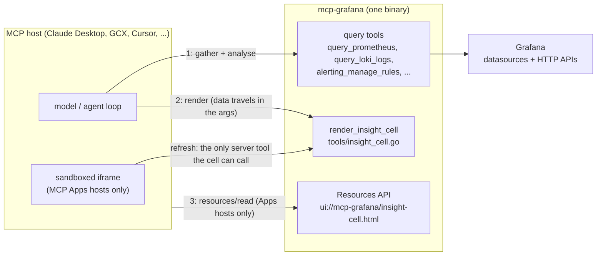
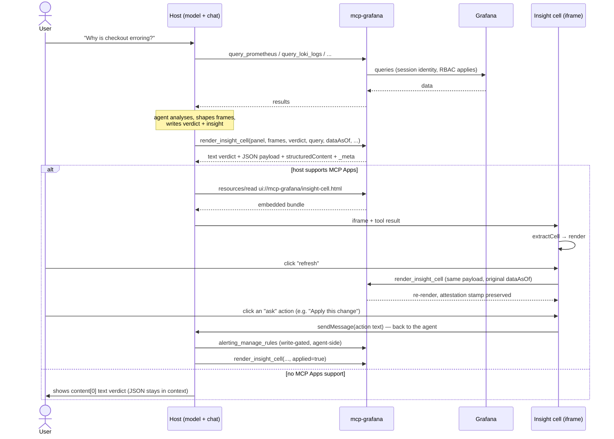
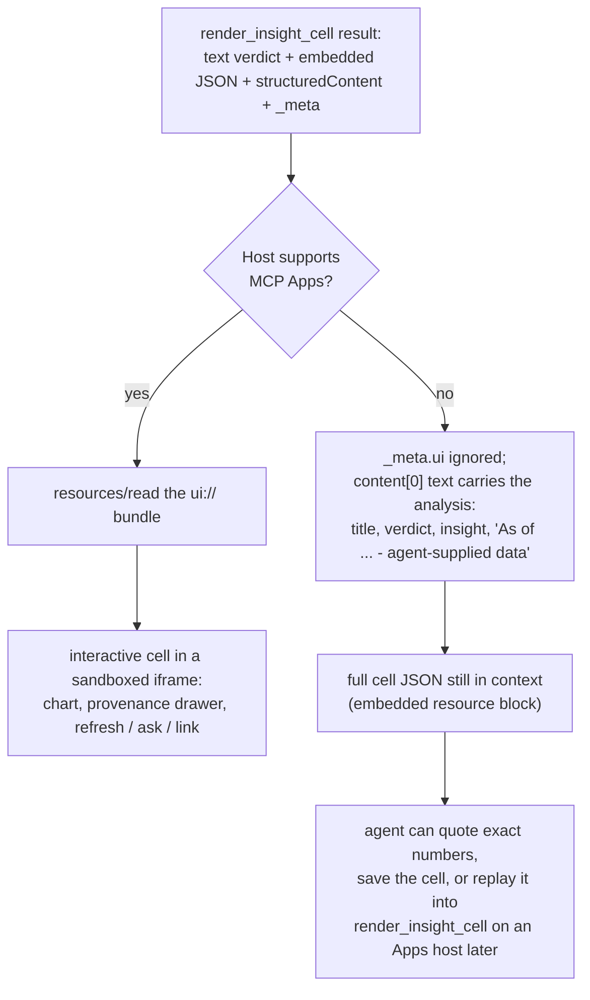
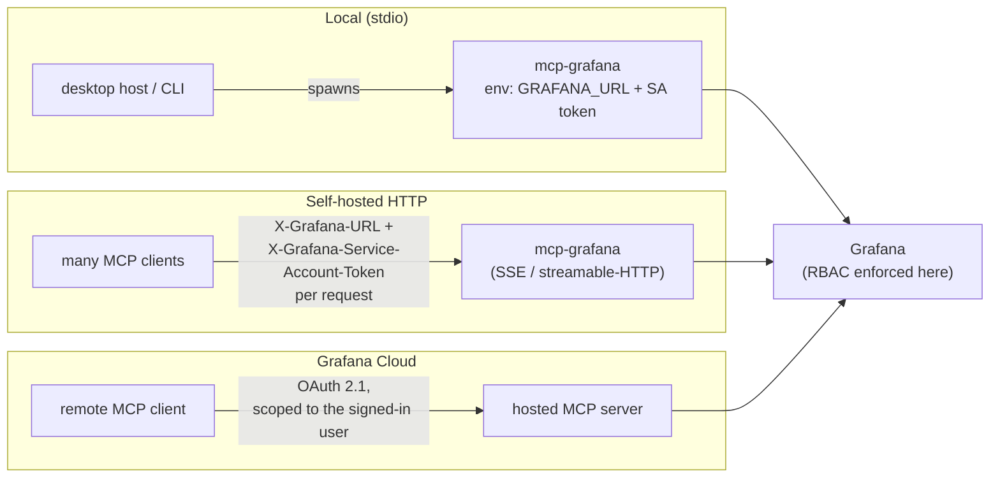

# MCP Apps in mcp-grafana

An **MCP App** is a self-contained HTML UI that a tool returns for a host to render inline, in a
sandboxed iframe, using the [MCP Apps extension](https://modelcontextprotocol.io/extensions/apps/overview).
Hosts that support it (Claude Desktop, VS Code Copilot, Goose, …) render the app; hosts that don't
ignore the metadata and fall back to the tool's text result. This is the mechanism behind
"OSS Grafana outside the UI": a render surface that travels with the MCP server.

This doc covers the framework that serves these apps, how a tool links to one, and the render
contract used by the **insight cell**. It builds on the foundation from
[#825](https://github.com/grafana/mcp-grafana/pull/825) (the original `WithUIResource` /
`RegisterAppResources` / `//go:embed` / `make build-ui` pattern and the first app, `ui/timeseries/`).

## The framework

Apps are registered in a single registry and served over the MCP Resources API.

- **`ui_apps.go`** — the `UIApp` struct and the `appResources` registry. `RegisterAppResources(s)`
  (called once from `cmd/mcp-grafana/main.go`) loops the registry and serves each app's HTML at its
  `ui://` URI with MIME type `text/html;profile=mcp-app`. Adding an app is one registry entry.
- **`ui_embed.go`** — each built bundle is embedded into the binary with `//go:embed`.
- **`ui/<name>/`** — one directory per app, a Vite + `vite-plugin-singlefile` project that builds a
  single `dist/mcp-app.html` (everything inlined, so the deny-by-default CSP needs no config). The
  built file is committed (root `.gitignore` re-includes `!ui/*/dist/`); `node_modules/` is ignored.
- **`make build-ui`** — rebuilds every `ui/*/` bundle. Run it when an app's `src/` changes; the
  committed `dist/mcp-app.html` is what `go build` embeds, so Node is not needed to build the server.

Current apps:

| App | Resource URI | Wired to |
|-----|--------------|----------|
| Panel Viewer | `ui://mcp-grafana/panel-viewer.html` | `get_panel_image` |
| Insight Cell | `ui://mcp-grafana/insight-cell.html` | `render_insight_cell` |

To add a new one: scaffold `ui/<name>/` (copy an existing app's Vite config), add a `UIApp` entry
to the registry in `ui_apps.go`, add its `//go:embed` line in `ui_embed.go`, and run `make build-ui`.

## Linking a tool to an app

A tool advertises its app in its definition and marks the app on its result:

```go
// definition — advertises the resource URI in the tool's _meta.ui
mcpgrafana.MustTool(name, desc, handler,
    mcpgrafana.WithUIResource(mcpgrafana.InsightCellResourceURI),
)
```

The host reads `_meta.ui.resourceUri` from the tool listing, fetches the resource, and renders it.
The result's own `_meta.ui.resourceUri` tells the host which app to hand this specific result to.

## The three output channels

Hosts differ in what they preserve, so a result carries the render payload three ways (see
`tools/insight_cell.go:insightCellResult`). An app should read them in this order:

1. **`structuredContent`** — the payload object (the spec channel). Some hosts drop this.
2. **an embedded `application/json` resource block** in `content[]` — kept by hosts that drop
   `structuredContent`. Claude Desktop converts it to a text block, so the app also scans text
   blocks for JSON starting with `{`.
3. **`content[0]` text** — a human-readable verdict; the fallback when there is no app at all.

## The insight-cell render contract

The insight cell is a generic surface: **one contract + one renderer that dispatches on
`renderHint.type`**. Adding a visualization is a new branch in the renderer, not a new app. The Go
types in `tools/insight_cell.go` mirror `ui/insight-cell/src/schema.ts` (the source of truth
for field names — they must match, since the embedded UI reads them).

Note the asymmetry between input and output: `renderHint` is part of the *output* contract,
assembled server-side. The tool *input* is a flat `panel` string plus individual field-config
arguments (`unit`, `thresholds`, `mappings`, …) — calling the tool with a `renderHint` object
fails with unknown arguments.

`render_insight_cell` is a **render substrate**: the agent gathers data with the existing query
tools (`query_prometheus`, `query_loki_logs`, `alerting_manage_rules`, `get_annotations`, Sift, …),
does the analysis, and passes the results here. The tool does not query datasources or fabricate
data.

Render types:

- **Core panels:** `timeseries`, `stat`, `bullet` (a value vs a target/SLO with qualitative
  bands), `bar`, `table` (read `frames`), `logs` (read `logs`), `trace` (read `trace`).
- **Synthesis views:** `worklist` (ranked triage), `rca` (root cause → evidence), `timeline`
  (change correlation), `cost` (cardinality/spend drivers).
- **Proposal view:** `rulediff` renders a proposed alert-rule change as a before/after diff. The
  cell proposes, it does not write — and it *cannot*: the tool is annotated `ReadOnlyHint` and the
  cell is structurally read-only. Action kinds are limited to `link` / `refresh` / `ask` (anything
  else is stripped server-side), and the only server tool the UI ever calls is
  `render_insight_cell` itself, for refresh. Applying a rulediff travels the `ask` path: the action
  hands text back to the agent, the agent performs the write with the existing write-gated
  `alerting_manage_rules` tool, then re-renders the cell with `applied=true`.

### The trust profile: `_meta["grafana.insightCell/v0"]`

Every result carries a trust profile alongside the data, so the cell is auditable regardless of
host. It contains:

- `query` — the expressions and datasource UIDs the data came from, as declared by the agent.
- `attestation` — `{ asOf, live }`: when the data was gathered (agent-suppliable via `dataAsOf`;
  a refresh replay preserves the original stamp) and whether the agent declared a live
  query + datasource. Declarations are recorded, not verified — the server cannot check that
  the frames actually came from the recorded query.
- `provenance` — `{ renderedBy, datasource, orgId?, rbacScope? }`. `renderedBy` names who
  packaged/rendered the cell (this server), deliberately not `author`: the data itself is
  agent-supplied and unverified.
- `renderHint` — the declarative "how to draw it" (type, unit, thresholds, mappings, …).
- `reasoning` — `{ question, verdict, confidence, source }`; `source: "agent"` marks agent analysis.

`dataMode` is `"agent-supplied"` when both a `query` and a `datasourceUid` are declared — the
frames *should* come from a real datasource read, but the server cannot verify that they do —
and `"synthesized"` otherwise (representative/sample or synthesis-view content assembled by the
agent). The labels are deliberately not `"live"`/`"mock"`: every claim in the cell is
agent-declared, and the wording should never promise verification the substrate can't perform.

## Insight-cell architecture, end to end

This section is the complete picture: every component, who calls what, where the cell sits in an
agentic workflow, what happens on hosts that cannot render, and how identity works across the
deployment modes.

### Components

Everything ships inside the `mcp-grafana` binary; there is no separate service.

| Component | File(s) | Role |
|---|---|---|
| Render contract | `tools/insight_cell.go` (Go structs) ↔ `ui/insight-cell/src/schema.ts` (TS mirror) | The `insightCell` JSON: `renderHint` + data payload + `meta` (verdict, attestation, provenance, query refs). Field names must match on both sides. |
| Tool handler | `tools/insight_cell.go` | Validates input (panel enum, RFC3339 `dataAsOf`), normalises the payload (`orEmpty`, `sanitizeActions`), builds the three-channel result + trust `_meta`. Makes **no data queries** — it only reads the already-configured Grafana base URL to format the datasource display string. |
| App registry | `ui_apps.go` | `WithUIResource` puts `_meta.ui.resourceUri` on the tool; `RegisterAppResources` serves the bundle at `ui://mcp-grafana/insight-cell.html` over the MCP Resources API. |
| Embedded bundle | `ui_embed.go` + `ui/insight-cell/dist/mcp-app.html` | Single self-contained HTML file (Vite + singlefile), committed and `//go:embed`-ed, so building the server needs no Node. |
| App bridge | `ui/insight-cell/src/mcp-app.ts` | Runs in the host's sandboxed iframe. `extractCell` (channel fallback ladder), `runAction` (link/refresh/ask), `specFrom` (cell → tool-args round trip for refresh). |
| Renderer | `ui/insight-cell/src/render.ts` + `format.ts` | One renderer dispatching on `renderHint.type`; Grafana-style unit/threshold/mapping formatting. Plain DOM, no framework. |
| Enablement | `cmd/mcp-grafana/main.go` | Opt-in tool category: `insight-cell` is **not** in the default `--enabled-tools` list; add it there to enable (`--disable-insight-cell` also exists). |



### Where it sits in an agentic workflow

The cell is the **last step of an investigation, not a data source**. The intended loop:

1. **Gather** — the agent calls the existing query tools; data flows under the session's identity
   and RBAC.
2. **Analyse** — the agent does the reasoning in its own context: correlates, ranks, forms a
   verdict.
3. **Render** — the agent calls `render_insight_cell` with the *shaped* result (frames or a
   synthesis payload), a one-line `verdict`, a 2–4 sentence `insight`, and the declared
   `query`/`datasourceUid`/`dataAsOf` provenance.
4. **Interact** — the user reads the cell and drives follow-ups through its actions; every write
   goes back through the agent, never from the cell.



### How it calls tools (and how tools call it)

The calling relationships are deliberately narrow:

- **Agent → `render_insight_cell`**: the only way a cell comes to exist. The data travels *in the
  tool arguments*; the handler repackages, it never fetches.
- **Cell → server**: exactly one tool, `render_insight_cell` itself, for refresh — the bridge
  replays the cell's own payload (`specFrom`) with the original `dataAsOf`, so a re-render never
  claims stale data is fresh. The call rides the host's existing MCP session; the iframe holds no
  connection details of its own.
- **Cell → host**: `link` (host opens an `http(s)`-validated URL) and `ask` (the action's text is
  handed back to the agent as the next user message). `ask` is the designed path for anything
  beyond re-rendering: the agent receives the text and decides, with its own write-gated tools,
  whether to act.
- **Nothing else.** Unknown action kinds are stripped server-side (`sanitizeActions`), which is
  what makes the tool's `ReadOnlyHint` annotation structurally true rather than aspirational.

### When the host can't render: is the MCP App still needed?

No. The MCP App is **one consumer of the contract, not a dependency of the tool**. A host that
does not support the Apps extension never fetches the `ui://` resource — it just ignores
`_meta.ui` (an unknown namespace) and consumes the result like any other tool result. Nothing on
the server behaves differently.



What survives without a renderer, by design:

- **The analysis** — verdict, insight, callout, and the attestation line all ride in the plain-text
  block, so a terminal host (e.g. a CLI agent) surfaces the reasoning verbatim.
- **The full payload** — the embedded JSON block keeps every frame value and the trust metadata in
  model context; the agent can cite exact numbers or diff two cells.
- **Portability** — the cell JSON round-trips back into `render_insight_cell` arguments (that is
  exactly what refresh does), so a cell produced on a text-only host can be re-rendered later on a
  host that has Apps support.

What is genuinely lost: in-place interactivity (the actions become data the agent may offer as
suggestions, not buttons), the visual encodings, and the trust-profile drawer (the `_meta` profile
still travels; the host just doesn't display it).

### Deployments and auth

The cell itself is **credential-free**: the iframe never sees a token, a Grafana URL it can call,
or a datasource credential. Identity lives entirely at the MCP-server boundary, and everything the
cell displays was fetched earlier by query tools under that same identity — so a cell can never
show data its session couldn't query. How that identity is established depends on how the server
runs (see the README for full configuration):

| Mode | Transport | Identity | Notes |
|---|---|---|---|
| Local / per-user | stdio | `GRAFANA_SERVICE_ACCOUNT_TOKEN` (or `_FILE` for rotation; basic auth via `GRAFANA_USERNAME`/`GRAFANA_PASSWORD` also works) from the environment | One process, one identity. Typical for desktop hosts and CLIs spawning the binary. |
| Shared / multi-tenant | SSE / streamable-HTTP | Per-request headers: `X-Grafana-URL`, `X-Grafana-Service-Account-Token`, optional `X-Grafana-Org-Id` | One process serves many callers, each with their own Grafana + credentials. TLS flags for both client and server sides; `Host`/`Origin` validation guards against DNS rebinding. |
| On-behalf-of (inside Grafana Cloud machinery) | HTTP | `X-Access-Token` + `X-Grafana-Id` forwarded to Grafana | Access-policy token plus the calling user's id token; requests execute as that user. |
| Hosted Grafana Cloud MCP server | HTTP (remote) | OAuth 2.1 browser authorization, scoped to the signed-in Grafana user | See [Grafana Cloud MCP server](https://grafana.com/docs/grafana-cloud/machine-learning/assistant/configure/cloud-mcp/). The tool surface there is operated by Grafana Cloud; `insight-cell` is an opt-in category wherever the server runs. |



In every mode the trust chain is the same: **Grafana enforces RBAC on the query tools → the agent
declares what it queried → the server records the declaration (attestation/provenance, unverified
by design — see the trust profile above) → the cell displays it.** The renderer adds presentation,
never privilege.

## Testing

- **Contract tests:** `go test ./tools/ -run InsightCell` and `go test . -run AppResources` cover
  the three output channels, the trust `_meta`, and app registration.
- **Protocol integration test:** `tools/insight_cell_integration_test.go` (build tag
  `integration`, no external services needed) drives every panel type through an in-process MCP
  client and asserts the full result shape, plus `resources/read` of the embedded bundle.
- **Visual check:** render in a host with MCP Apps support. The fastest loop is the
  streamable-HTTP transport with `--allowed-origins '*'` (dev only — it disables Origin
  validation) + the
  [MCP Apps basic-host](https://github.com/modelcontextprotocol/ext-apps/tree/main/examples/basic-host);
  or load the server in Claude Desktop.
